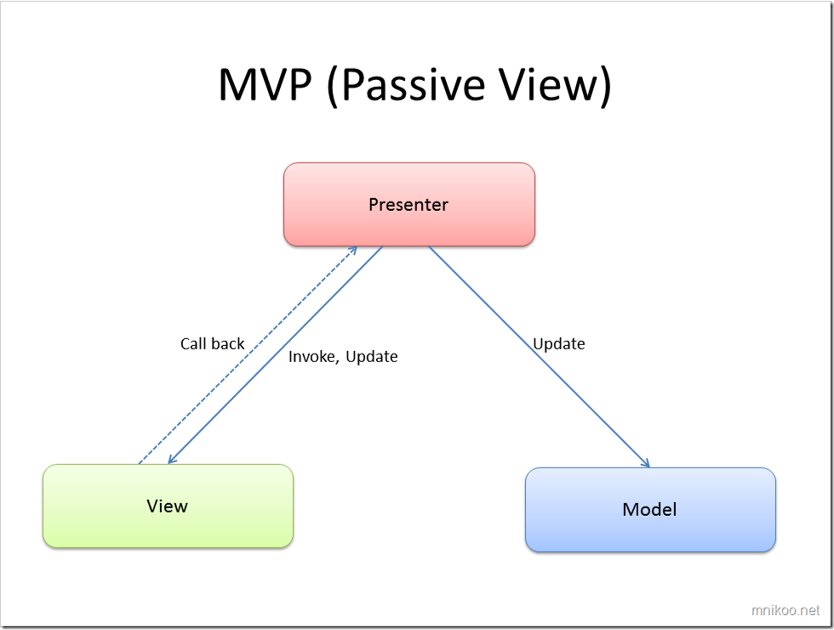
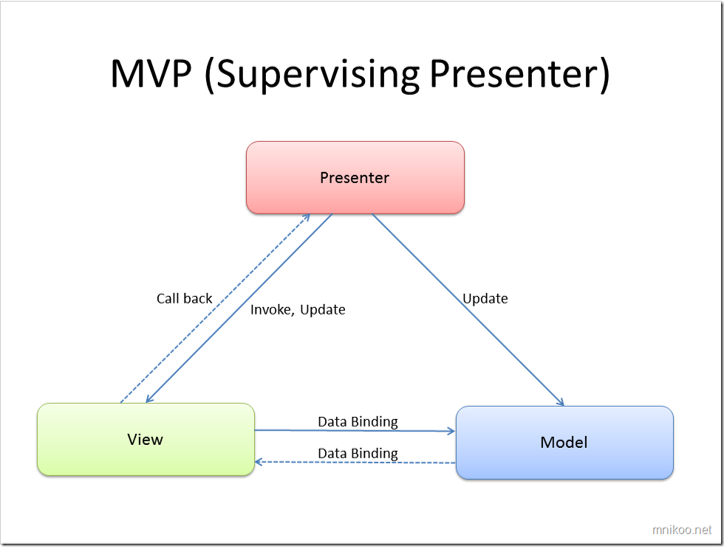

# MVP Pattern

## Introdução
- O Padrão MVP é um padrão de arquitetura à semelhança do padrão MVC (ver :https://github.com/patriciamacedo/MVCPatternJava). 
- Existem duas formas do padrão MVP:
   - Passive View 
   - Supervisioning Presenter
    

- Este padrão organiza uma aplicação dividindo as suas componentes em Model, View e Presenter:

    - Na sua versão  **Passive View**
    
        - Model 
            - Sabe tudo sobre :os dados persistentes  que devem ser apresentados;As operações que serão aplicadas para transformar os objectos.
            - Não sabe nada sobre as interfaces do utilizador;como os dados serão mostrados; As acções das interfaces usadas para manipular os dados.

        - View
            - Refere-se ao objecto Presenter;
            - Define como os dados serão visualizados pelo utilizador;
            - Recebe as notificações do Presenter, para atualizar a visualização dos dados.

        - Presenter
            - Sincroniza as acções do View com as acções realizadas pelo Model;
            - Trabalha com a informação recebida pela View, processa e envia o pedido ao Model;
            - É notificado pelo Model, das alterações realizadas, e em função disso atualiza a View.
        
     
     
        - O Padrão  na sua versão **Superving Presenter**: 
            - A View interaje diretamente com o modelo através do mecanismo de data-binding .
            - O presenter atualiza o modelo , e manipula o estado da View em situações mais complexas, onde é necessário introduzir lógica na apresentação dos components. 

     


### Exemplo de aplicação

  - Pretende-se realizar uma aplicação para gerir a formação de grupos de programadores que deverá ter a seguinte interface 

    

    usando o padrão **MVP - Supervisioning Presenter**


- Existem 3 componentes base
    - Model:  ``Group`` 
    - Presenter: ``GroupPresenter`` 
    - View: ``GroupUI`` 
    
- Para ser possivel fazer o binding entre o model e o view, tem que:

    1 - identificar quais os pares de elementos que vão estar ligados entre a view e o model:
    - ``groupListView`` (ListView) - ``groupList`` (List)
        
    -  ``txtGlobalIndex`` (TextField)- ``globalIndex`` (double)
        
    -  ``txtLeader`` (TextField) - ``leader`` (Programmer)
        
    2 - Para ser possivel usar o "dataBinding",  as propriedades dos pares de elementos, teem que ser conectadas. Então o ``groupList``, o ``globalIndex`` e o ``leader`` terão que ser  do tipo "property".
     
   ```java
    public class Group {
    
        private String name;
        // Properties
        private SimpleListProperty<Programmer> personList;
        private SimpleDoubleProperty globalIndex;
        private SimpleObjectProperty<Programmer> leader;
    
        public Group(String name) {
            ObservableList<Programmer> observableList = FXCollections.observableArrayList(new ArrayList<Programmer>());
            personList = new SimpleListProperty<>(observableList);
            this.name = name;
            globalIndex=new SimpleDoubleProperty(0);
            leader= new SimpleObjectProperty();
            leader.set(new Programmer(0,"none",0,0));
    
        }

    }
   ```
  
   3 - Na classe `` GroupGUI`` tem que se conectar os elementos através do binding (nno método ``initComponents()``)
  
  ```java
          groupListView.setItems(model.getPersonList());
  
          Bindings.bindBidirectional(txtGlobalIndex.textProperty(),model.globalIndexProperty(),
                  new NumberStringConverter());
  
          Bindings.bindBidirectional(txtLeader.textProperty(), model.leaderProperty(), new myProgrammerConverter());


  ```

  - A classe `` groupPresenter`` vai essencialmente:
    
    - Trabalhar com a informação recebida pela View, processa e envia o pedido ao Model: método ``doAddMember``
    - Sincronizar as acções do View com as acções realizadas pelo Model: neste exemplo trata essencialmente do procesamento de erros, já que o restante é realizado atraves do databinding;
       
 - Tal como no MVC, criamos uma `` Factory`` para lidar com a coneção entre os componentes view, model e presenter

```java
    public class FactoryMVPGroup {
    
        public static GroupUI create()
        {
            Group model = new Group("PA-123");
            GroupUI view = new GroupUI(model);
            GroupPresenter presenter = new GroupPresenter(view, model);
            view.setTriggers(presenter);
            return view;
        }
    }
```

- Na classe que cria a App JavaFX , cria-se uma View que é do tipo "Panel" e associa-se à janela principal.
```java

     @Override
     public void start(Stage primaryStage) {
         BorderPane window = new BorderPane();
         window.setCenter(FactoryMVPGroup.create());
         Scene scene = new Scene(window, 400, 250);
         primaryStage.setTitle("Group Programming");
         primaryStage.setScene(scene);
         primaryStage.show();
     }
```
