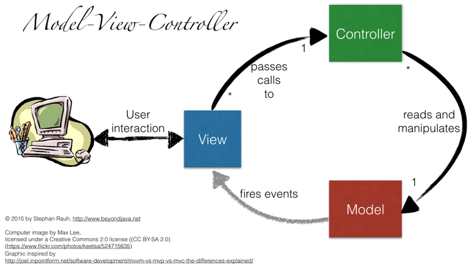

# MVC Pattern

## Introdução
- O Padrão MVC é um padrão de arquitetura.

 

- O Padrão tem como objetivo organizar uma aplicação dividindo as suas componentes em
    - Model 
        - Sabe tudo sobre: os dados persistentes  que devem ser apresentados;as operações que serão aplicadas para transformar os objectos.
        - Nada sabe sobre: as interfaces do utilizador, de como os dados serão mostrados, as acções das interfaces usadas para manipular os dados.
    - View
        - Dispara as operações de consulta do Model (via Controller) para manipular/obter os dados e visualizá-los;
        - Define como os dados serão visualizados pelo utilizador;
        - Mantém consistência na apresentação dos dados quando o Model muda;
    -Controller
        - Sincroniza as acções do View com as acções realizadas pelo Model;
        - Trabalha somente com sinais e não com os dados da aplicação;
        - Sabe os meios físicos pelos quais os utilizadores manipulam os dados no Model;

## Exemplo
- Pretende-se realizar uma aplicação para gerir a formação de grupos de programadores que deverá ter a seguinte interface 


### 1ª Abordagem [Model View]- Separar nivel de Interação/Viualização com o Nivel da Lógica da Aplicação    

- Usamos o padrão Observer
    - A classe GroupUI assume o papel de Observer
    - A classe Group assume o papel de Subject
    - Cada vez que um Membro é adicionado ao Grupo o Observer é notificado
    - A classe GroupID implementa o método update, que é repsonsável por atualizar a ListView (componente JVAFX que mostra a list de membros) e a Label que contem informação sobre o GlobalIndex do Grupo

### 2ª Abordagem [Model View Controller]- Aplicar o padrão MVC


- Existem 3 componentes base
    - Model:  Group
    - Controller: GroupController
    - View: GroupUI
- Estes componentes bases tem que ser conectados entre si. Para tal usa-se uma Simple Factory
```java
    public static GroupUI create() {
        Group model = new Group("PA-123");
        GroupUI view = new GroupUI(model);
        GroupController controller = new GroupController(view, model);
        view.setTriggers(controller);
        return view;
    }
```
- Na classe que cria a App JavaFX , cria-se uma View que é do tipo "Panel" e associa-se à janela principal.
```java
     @Override
     public void start(Stage primaryStage) {
         BorderPane window = new BorderPane();
         window.setCenter(FactoryMVCGroup.create());
         Scene scene = new Scene(window, 400, 250);
         primaryStage.setTitle("Group Programming");
         primaryStage.setScene(scene);
         primaryStage.show();
     }
```
## Exercícios

 1. Acrescente uma nova funcionalidade à Aplicação que permita remover elementos do Grupo. A ListView deverá permitir selecionar o item ques e pretende remover.
    - Adicione um novo "botão" a `GrupoUI`
    - Adicione um evento associado ao novo Botão
    - Implemente o método no `GrupoController` que gere a interação Remover
     
 2. Acrescente uma nova funcionalidade à Aplicação de forma de ser possivel visualizar qual o leader do grupo recomendado, para aquele conjunto de membros.
  Nota: A logica para "recomendação" de um leader para o grupo está implementado no método `Programmer getLeader()` da classe `Group`. 

 

